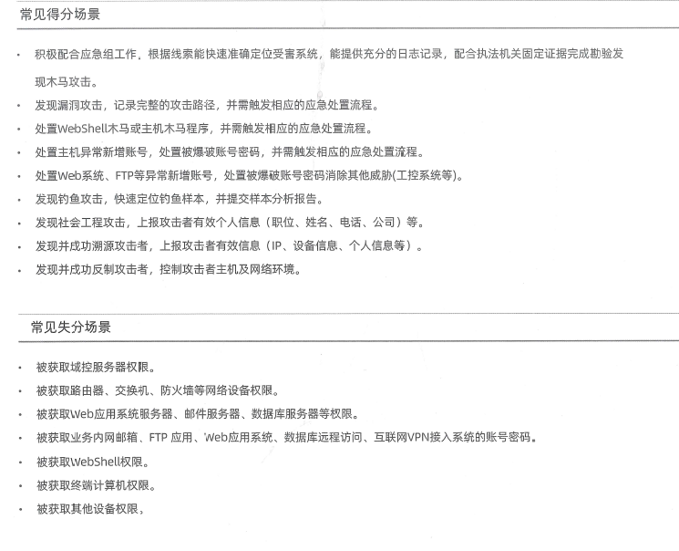
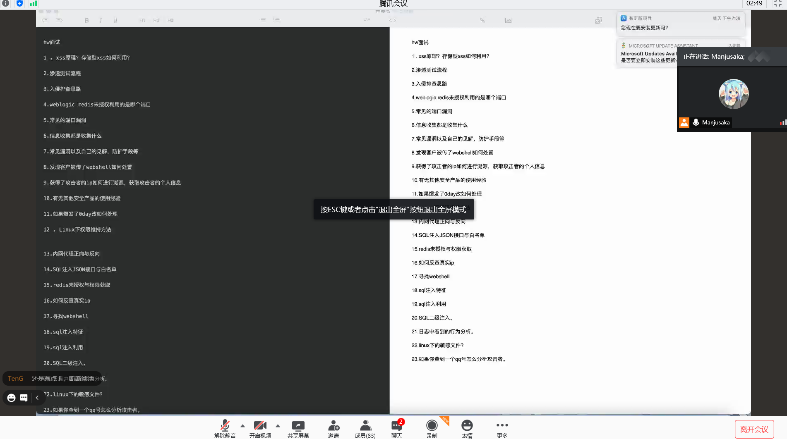

# 技术关键词

## 蓝队

### 参考资料

《实战攻防企业对抗指南》——长亭

### 分数规则



不同地方规则不同，需要多了解

### 安全配置

加固不能用红队工具扫描，容易出报警，或者破坏agent

基本不用动，大部分agent会完成，部分需要自己配置

```
ps aux          // 进程信息
netstat -ano    // 网络信息
netstat -ano | grep "0.0.0.0"   // 本地的开放端口
w       // 查看在线用户
dmesg   // 查看内核输出（提权exp可能导致内核崩溃，内核会把信息放到日志里）
lasy    // 历史登录 + 登录ip
cat xxx         // 查看日志
tail -f xxx     // 查看实时更新的日志

```

### 0day 响应

收集提交得分

已经爆出，并且exp和poc已经成熟：

```
def 避免被攻击:
    if(有安全设备):
        自己写规则识别并阻断
```

（哪怕被打穿，也要使用）全流量检测设备 -> 找到 0day 并上报

先关闭系统+溯源+找到利用

### 权限维持

1. 使用 crontab 定时触发恶意脚本
2. ssh 后门:进程注入，hook 密码校验函数，得到管理员密码
3. 修改管理员二进制 文件 创建软链接 使管理员输入指定命令时执行恶意脚本
4. 环境变量劫持
5. 内核后门（难度较高，需要编译内核并重启，优点，隐蔽性强）
6. pam后门
7. /init.d/ 系统启用时默认运行的脚本

### 内网代理正向反向

### SQL 注入 JSON 接口与白名单

### redis 未授权访问

6379 user_pass 默认没设置
系统内写文件，构成安全威胁

1. 写ssh私钥
2. 写crontab    定时执行
3. 写init.d     启动执行
4. redis docker 启动的 可以写dockerfile

### 反查真实ip

fofa 互联网搜索引擎

1. 渗透手段获取 ssrf/dnslog 获取真实ip
2. 查找历史解析
3. cloudflare github 获取真实ip
4. fofa证书

### 标靶防守

内外网各一个标靶

24h值守，文件，进程，用户等是否有多了少了。

蚁剑自定义规则，文件落地，修改时间

### 技巧

**755权限**：防止其他用户写入

**只入网，不出网**：防止ssrf+反弹

**系统日志**：/var/log

linux 使用前最好进行**时间校准**：linux date 命令（保证服务器和手机一秒不差，防止攻击的记录产生问题）

- ∵中国时间：UTC+8 ∵wireshark 可能使用标准时间 ∴日志时间可能偏 8 小时

**日志分析**：定位（异常进程，异常文件的）时间范围

（mysql+php+nginx）**SQL 注入日志**：nginx（access.log：明文存储），mysql（binlog.bin：二进制存储，需要专门工具读取，需要手动开启）都会记录

**网页篡改日志溯源**：被篡改的地方（源码？数据库？）

- 如果攻击者从数据库里改网站：一定需要执行sql语句，才能使数据发生变化 -> 通过二进制日志，打印出近期执行的sql语句，再匹配篡改的内容 -> 得到攻击时间 -> 看nginx日志

第一，找到恶意sql执行时间附近的恶意攻击者的源ip

第二，查找日志的 User Agent + 源ip -> 当作攻击者的指纹（所有有这个指纹的数据包信息）

由此导出nginx的日志，可以找到生产环境的缺陷，让甲方在hvv期间修复漏洞

**反制**：攻击者是谁

1. 红队反弹服务器一般喜欢用国外的（不需要备案，乱扫乱批量比较多）-> 业务只在国内开展时，可以完全屏蔽国外网络（禁止国外ip访问生产系统：减少攻击，方便反制）
2. [ip画像](https://www.ipip.net)

- ip 是哪个机房：收集子域名、c段、绑定信息

**蜜罐**：可能会部署，初级或者中级可能值守，但是不太会让你去部署

指挥官会更早的做好策略，只需要值守岗位就好了

### 企业网络架构

**内网接入端**：出口可能不止一个（e.g. 联通+电信），通过路由器连接在一起（路由器外部接入统称 ISP 接入端）

**常规防火墙**：设置安全规则 -> 隔离区域（常见：访客区，办公区，服务器区，vpn区）+ 包过滤

防火墙外的区域称为 untrust/outside

**办公区**：

**DMZ 区域**：使用NAT技术使内网服务器映射到外网的区域

*DMZ 和办公区肯定能访问内网接入端/外网（需要更新等服务），内网接入端/外网不能访问办公网

*办公区肯定能访问 DMZ（需要管理机器），DMZ 不能访问办公网

> 不需要收集反馈信息：DMZ 部分系统直接能从公网访问，不需要收集反馈信息（例如办公系统/OA 系统）

**安全认证网关**：接入控制 -> protal认证 连接wifi或打开指定页面 有agent才允许上网

### 安全设备

没有设备时，一定要做一个全流量检测，借一台服务器也行，

edr

**VFW/下一代防火墙/SDN**：融合多个功能

*外企用SDN较多，也相对成熟。SDN技术没全面展开

**IPS（入侵防御）**：必定集成了检测功能

最少三个接口（部分把管理接口做到桥接口里）：管理口（管理设备+为设备进行更新，连接管理交换机），桥接口*2（连接两个接口的流量）

唯一部署方式：

- 透明模式：代替某个链路，恶意流量直接丢弃

**IDS（入侵检测）**：有一些能调用其他设备进行防御

一共有两个接口：管理口（管理设备+为设备进行更新），镜像口（检测流量）

最好是可以联网的，规则库可以实时更新

唯一部署方式：

- 旁挂部署：在防火墙后，只监控一条链路（e.g. 检测防火墙到DMZ的流量）

**waf**：

部署方式：

- 透明模式

Q https识别不到：

- if 自签证书：导入https私钥
- 没有证书：向waf导入证书

### hvv-等级和职责

必须学习红队思路（非常清楚），拥有反制能力

防御体系：出方案，布置安全策略

得分主要为溯源反制

高级：指挥官，下发策略，提前入场，战略布置

中级：溯源+反制+画像+意图分析

初级：看监控，上报可疑的 ip，看懂较复杂的网络拓扑（自己的设备在网络结构的哪里，主要负责保护哪部分网络），熟悉设备（设备出问题要去修理）

只要不是高级/指挥/带队，所有的事情都要自己干

为什么设备抓到的流量很少

### 应急响应

团队建设：

- 安全监控：看态势感知、SOC、日志、waf、堡垒机等，发现入侵就写报告
- 响应组：
  - 业务+系统
  - 服务器+主机

溯源思路：

工具：

### 常见端口和漏洞

weblogic 7001
redis 6379

21 ftp服务：anonymous，匿名未授权访问，爆破
22 ssh：root 密码爆破，后门用户，默认密码
23 telnet：（一般会发生在路由器and交换机and嵌入式设备and管理端口）弱口令
25 smtp：默认用户，默认密码，邮件账号爆破
80 http：（web常见的漏洞）owasp top 10，中间件反序列化，中间件溢出，fastcgi 配置不当造成 fastcgi 端口泄露
110 pop3：默认用户，默认密码，邮件账号爆破
443 https：openssl，心脏滴血（影响范围较小），SSL/TLS 低版本存在的漏洞
135 139 445 netbios smb：MS17-010
3389 RDP：CVE-2019-0708

### 入侵排查

两种情况：已经被入侵or正在被入侵

已经被入侵：

```
if(对方目的达到，木马销毁):
    知道被入侵后，定位入侵时间点
    if(云服务器):
        快照    // 目的：封存内存，这样才有可能获取到攻击者的shellcode和动作
    if(定位到时间点):
        查设备流量，找到木马链接
    查找系统内相关日志，找到相关线索
    if(日志全被删除):
        因为机器快照已经建立，所以可以用 winhex 恢复日志（概率较高，不过不一定完全回复）

if(目的未达成，数据正在回传，木马、后门正在运行):       // 需要无缝提取，并且绝对不能登录
    if(内存马):     // 很可能上线就销毁
        使用 volatility -> 建立快照、提取内存、定位到shellcode、找到对方IP  // 内存取证工具
        if(使用常见C2工具):
            根据流量分析入侵者意图
        关闭服务器or在防火墙中封IP
        登录服务器，对shellcode进行移除
        if(木马具有持久化):
            重启进入安全模式，排查注册表、计划任务、服务、放大镜后门、shift后门等位置
```

正在被入侵：

```
日志一定要采用远程日志，例如 Linux 的 rsyslog   // 优点：不怕日志被攻击者删除
if(入侵者在尝试进行攻击):   // 弱口令爆破
    一定要找到入侵者的源ip，然后在防火墙下发阻断策略
```

### webshell检测

静态检测

动态检测

日志检测

语法检测

统计学检测

特征检测

变形检测

拟态检测

如何发现webshell？

离线：D 盾、[河马](https://www.shellpub.com/)

在线：webdir+（百度）、河马

针对：冰蝎、菜刀

github开源的漏洞工具：[GScan](https://github.com/grayddq/GScan)

PHP 的危险函数
冰蝎：openssl_decrypt
PHP 木马关键函数

webshell作用？

adminer.php：在 /tmp 目录下
nginx 日志or中间件日志：根据木马的名字查，往上找木马上传点
PHP-fpm 日志：绕过disable_functions 进行提权、使用 GC-bypass等，会留下痕迹
mysql 的二进制日志：确定攻击者执行过的语句

### 溯源反制

红队水平和疏忽

红队用自己的博客服务器

我的攻击过程是什么样的，哪一步容易出问题

随便那个 cms，改个名再部署（苹果cms -> 香蕉cms），发布香蕉 exp，红队不会认真审计，直接用，执行里面的远控

ip 溯源：

```
www.ipip.net 查 ASN 数据
根据ip地址，判断地址范围
直接进行扫描，先常规渗透手段
if(红队比较菜，在自己的服务器上搭建渗透测试靶机，而不使用docker，上面有文件上传功能):
    getshell
if(红队用自己博客等服务器进行攻击):
    ip 反差域名，能得到红队攻击者的 id，问问这人是谁
```

### 安全产品使用经验

EVE-NG 百度下载配置 能模拟很多安全设备 例如 F5 防火墙、山石、华为等防火墙

ensp 华为模拟器

### 面试题



## 通用能力

"软柿子"模型，不同队伍判断不同

利用游戏规则

## 红队

"软柿子"参考如下：

- 靶心系统对外网开放
- 办公网络为AD域
- 重要系统登陆口没有二次验证
- 分公司很多，和集团总部相同，办公网络可能是林结构
- 对外开放vpn、citrix之类登陆口
- 办公网段存在对外开放的web系统

标靶定位、判断类型

ip 信息收集

办公网络信息

远程办公系统

## 常规企业安全能力

业务系统安全的单点建设：业务开发引入 SDL，系统上线后渗透测试，最好有白盒审计

系统性安全建设：SIEM 系统，安全相关行为和事件做到可查可溯源

整体安全能力评估：红队测试（检测能力和响应能力）

## 资产梳理

资产梳理，主要分为业务系统资产、设备资产、外包或第三方服务资产甚至还要包含历史遗留资产
(泛指边缘化、访问量极少的、陈旧过时缺少维护的系统，例如旧服务接口、历史版本的APP等

## 重点排查目标

C:/Windows/             安装目录

C:/Windows/System32/    根目录

%temp%

### everything 搜索木马文件

最好用免安装版本

最好配合设备去搜索：木马上传/连接

+时间排序去过滤

### msconfig/火绒剑

netstat -ano

云悉看一下是否是恶意ip

tasklist [pid]      定位进程

wmic process | findstr "xxx"

4624/4625/4720/4738/4724

### 隐藏用户

计算机管理

lusrmgr.msc

### 踢出用户

query user          查看建立会话的用户
logoff [uname]      踢出用户

## 常用工具

PC hunter/ProcessExplorer/D盾/火绒剑/notepad++

## 扫+问

linux

ls -alt

`/tmp` 和 `/usr/bin` 和 `/usr/sbin` 都是很容易放置恶意软件的目录

linux 能打进来的不多，win更多

find ./ -type f -name "*.jsp" | xargs grep "exec"

find ./ 

日志

weblogic