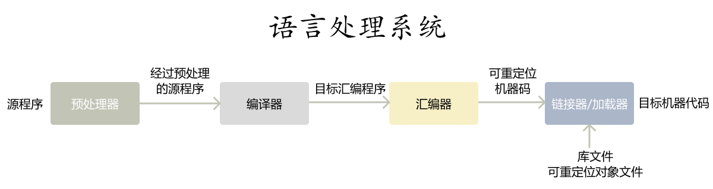

# 编译

编译器关注的核心问题是生成代码的**正确性**和**质量**。

## 语言处理器

**编译器** (compiler) 将高级语言翻译成计算机可执行的代码。

**解释器** (interpreter) 直接逐句执行源程序。

**混合编译器** (hybrid compiler) 将源程序通过翻译器翻译成字节码 (bytecode) ，再和输入一起进入虚拟机。例如 Java。

在 Java 中，为了加快运行效率，**即时编译器** (just in time compiler) 在等待输入时，先将字节码翻译成机器语言，再执行程序。

预处理器 (preprocesser) 聚合源程序，并把宏转化为源语句。

## 编译器结构

编译器由**分析** (analysis) 和**综合** (synthesis) 两个部分组成。

### 分析部分

分析部分把源程序分解成多个组成要素，并在组成要素之上添加语法结构，得出一个中间表示。

当出问题时，分析部分提供信息，使用户修改程序。

分析部分收集源程序信息，存放在**符号表** (symbol table) 中。

分析部分是编译器的**前端** (front end)。

### 综合部分

综合部分根据中间表示和符号表中的信息，

综合部分是编译器的**后端** (back end)。