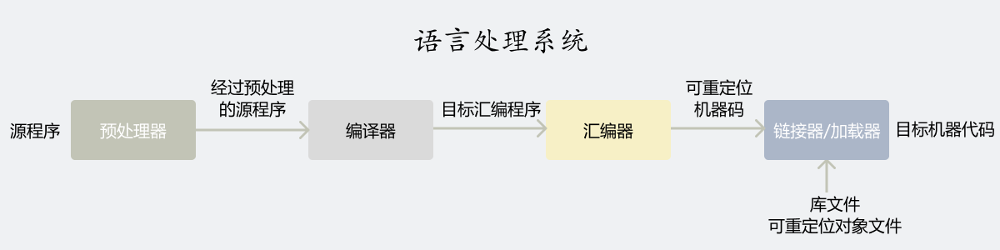
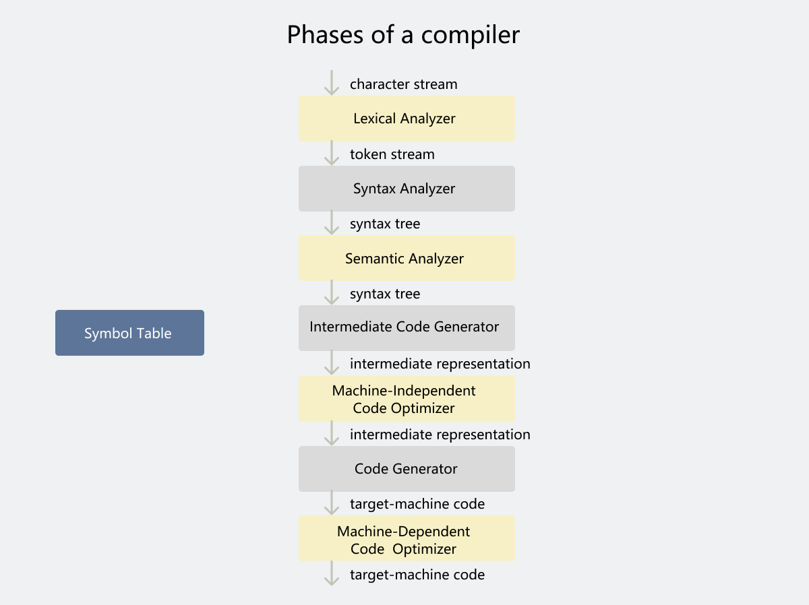

# 编译

编译器关注的核心问题是生成代码的**正确性**和**质量**。

## 语言处理器



**语言处理器** (language processor) 有以下几种类型：

**预处理器** (preprocesser) 聚合源程序，并把宏转化为源语句。

**编译器** (compiler) 将高级语言翻译成计算机可执行的代码。

**解释器** (interpreter) 直接逐句执行源程序。

**混合编译器** (hybrid compiler) 将源程序通过翻译器翻译成字节码 (bytecode) ，再和输入一起进入虚拟机。例如 Java。

在 Java 中，为了加快运行效率，**即时编译器** (just in time compiler) 在等待输入时，先将字节码翻译成机器语言，再执行程序。

## 编译过程



在应用时，上图中很多步骤成组出现，部分中间表达也不需要明确出现。

部分编译器在前端和后端之间存在**与机器无关的代码优化** (machine-independent code optimization) 步骤，以使后端产出更好的目标程序。

### e.g.

```
position = initial + rate * 60              -- 词法分析 ->
==========================================================
symbol table: id
------------------
| position | ... |
------------------
| initial  | ... |
------------------
| rate     | ... |
------------------

(id, 1) (=) (id, 2) (+) (id, 3) (*) (60)    -- 语法分析 ->
==========================================================
      =
    /   \
(id, 1)  +
       /   \                                -- 语义分析 ->
    (id, 2)  *
           /   \
        (id, 3) 60
==========================================================
      =
    /   \
(id, 1)  +
       /   \                                -- 中间代码生成 ->
    (id, 2)  *
           /   \
        (id, 3)  inttofloat
                    |
                    60
==========================================================
tl = inttofloat(60)
t2 = id3 * ti
t3 = id2 + t2                               -- 代码优化 ->
id1 = t3
==========================================================
tl = id3 * 60.0
id1 = id2 + t1                              -- 代码生成 ->
==========================================================
LDF R2, id3
MULF R2, R2, #60.0
LDF R1, id2
ADDF R1, R1, R2
STF idly Rl
```

## 编译器结构

编译器由**分析** (analysis) 和**综合** (synthesis) 两个部分组成。

### 符号表

**符号表** (symbol table) 存储了变量名和属性。

属性包含变量名存储分配，类型域、作用域等信息。

对于过程名，属性还有参数数量、类型，每个参数的传递方法以及返回类型。

### 分析部分

分析部分是编译器的**前端** (front end)。

分析部分把源程序分解成多个组成要素，并在组成要素之上添加语法结构，得出一个**中间表示** (intermediate representation)。

当出问题时，分析部分提供信息，使用户修改程序。

分析部分收集源程序信息，存放在符号表中。

**符号表**存储了所有的源信息，供编译的各个阶段调用。

#### 词法分析

**词法分析** (lexical analysis) 也称为**扫描** (scanning)。

**词素** (lexemes) 是「词法分析」读取字符流后，将数据流合成的**有意义的序列**。

对于每个词素，词法分析器产生**词法单元** (token) 作为输出。

词法单元格式为 `<token-name,attribute-value>`，`token-name` 是用于语法分析的抽象符号，`attribure-value` 指向 symbol table 中关于这个 token 条目的位置。

#### 语法分析

语法分析 (syntax analysis) 也称为**解析** (parsing)。

**语法树** (syntax tree) 是语法分析常用的表示方法，树中的每个节点代表一次运算。

语法树标明了运算的先后关系。

#### 语义分析

语义分析 (semantic analysis) 使用语法树和符号表的信息检查源程序和语言定义的语义是否一致。

语义分析器**收集类型信息**，并存储在语法树和符号表中。

同时语义分析进行**类型检查** (type check) 、自动类型转换等操作，如果不符合定义，则编译器会报告错误。

### 综合部分

综合部分是编译器的**后端** (back end)。

#### 中间代码生成

中间代码生成 (intermediate code generation) 常用**三地址代码序列**表示，例如 `t2 = id3 * t1`。

#### 代码优化

不同编译器对于代码优化工作量差异很大，工作量大的编译器可能在编译阶段花费大量时间，同时也有些简单的方法能极大提高效率，同时又不过多的增加编译时间。

#### 代码生成

代码生成时，合理分配寄存器和存放变量的值特别重要。

## 编译器开发

编译器组成部分可以充分利用现代软件开发环境，开发编译器结构的组件。

## 编译器发展历史

编译器推动程序简单易用，同时自身作为一个大型程序，需要达到效率和性能的平衡。

编译器对于如何做到最优是无法判定的。

有关编译器的研究也是有关如何使用理论来解决实际问题的研究。

## 编译器相关科学

接受问题，写数学抽象表示，数学解决。

### 编译器设计和建模

设计正确的数学模型，选择正确的算法进行研究。

### 代码优化

代码优化必须满足下列目标：

- 必须正确
- 有效提高很多程序的性能
- 编译时间保持合理
- 工程方面的工作可管理

解决复杂性、开放性问题的一般方法。

## 应用

### 实现高级编程语言

弥补高层次抽象所带来的低效率，例如取消 C 中的关键词 register，使得程序员无需指定寄存器分配。例如 Java 动态编译，在运行时刻将字节码编译成代码。

### 针对计算机结构的优化

编译器对操作系统中的并行性和内存结构做出优化。

### 新计算机体系结构设计

现代编译器需要在处理器**设计阶段**开始开发，以最大程度利用处理器特征。

#### CISC

CISC (Complex Instruction-Set Computer, 复杂指令集计算机) 通过复杂的指令集让汇编编程更加容易。

#### RISC

RISC (Reduced Instruction-Set Computer, 精简指令集计算机)