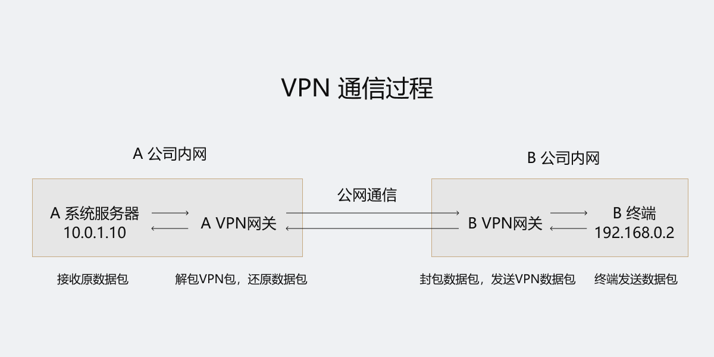

# VPN 通信原理

## 分类

**隧道协议**：

- PPTP：OSI 第二层
- L2TP：OSI 第二层
- IPSec：OSI 第三层

**应用**：

- Access VPN(远程接入 VPN)：客户端到网关
- Intranet VPN(内联网 VPN)：网关到网关，使用同公司资源
- Extranet VPN(外联网 VPN)：合作伙伴

**设备类型**：

- 路由器式 VPN
- 交换机式 VPN
- 防火墙式 VPN

**实现原理**：

- 重叠 VPN：
- 对等 VPN：

## 实现方式

- VPN 服务器：网络中心搭建

- 软件 VPN

- 硬件 VPN

- 集成 VPN

## 常用技术

- MPLS(Multi-Protocol Label Switching， 多协议标记交换)

- SSL：支持SSL的HTTP协议

- IPSec