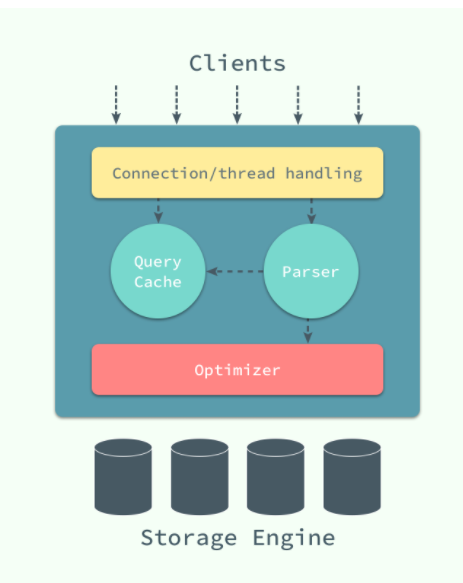

# MySQL

在 Unix 上，启动一个 MySQL 实例往往会产生两个进程，mysqld 就是真正的数据库服务守护进程，而 mysqld_safe 是一个用于检查和设置 mysqld 启动的控制程序，它负责监控 MySQL 进程的执行，当 mysqld 发生错误时，mysqld_safe 会对其状态进行检查并在合适的条件下重启。

## MySQL 架构

MySQL 分为三层结构

顶层是连接，线程处理等部分。

第二层为核心服务部分，包括对 SQL 的解析、分析、优化和缓存等功能。

第三层是数据存储和读取的引擎。

## MyISAM

## 攻击面

控制使用的查询类型，以降低服务器性能，或者利用 hash index 进行大量的全表查询
