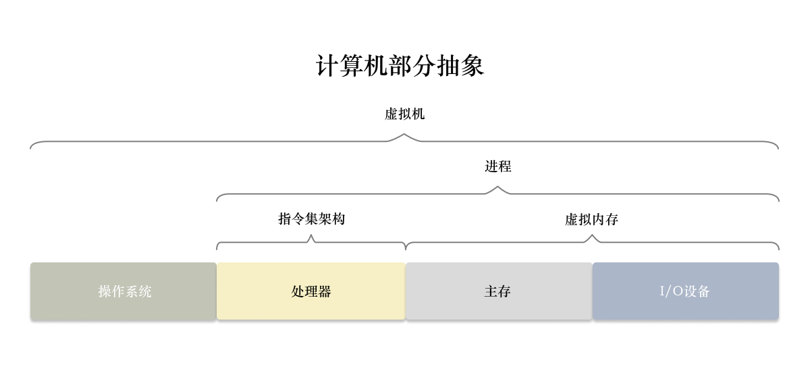

# 操作系统

对操作系统的了解能让我感受到精密复杂工程中的设计美。

程序对于所有硬件设备的访问都要通过操作系统。

《深入理解计算机系统》将操作系统分为如下部分：

1. 基本模型 + 概念
2. 信号的表示处理
3. 程序机器级表示
4. 处理器体系结构
5. 优化程序性能
6. 存储器层次结构
7. 异常控制流
8. 虚拟内存
9. 系统级 I/O
10. 网络编程
11. 并发编程

因为需要向应用靠拢，我重点关注和学习**虚拟内存**和**系统级 I/O** 两块内容，并揭示他们所存在的设计美和不完美。

## 组成

操作系统由以下部分组成：

- **总线**：贯穿整个系统的一组电子管道
- **I/O 设备**：磁盘，键鼠和显示器等设备
- **主存储器** (DRAM, 主存)：临时存储设备，存放处理器需要的程序和数据
- **处理器**：解释/执行的引擎，核心是寄存器 (register)

处理器一般拥有以下部件：

- **寄存器文件**
- **ALU** (算数逻辑单元, Arithmetic logic unit)
- **cache** (高速缓存存储器, 高速缓存, cache memory)：芯片上的小型缓存，使用 SRAM 硬件技术实现。L1 cache 访问速度几乎和寄存器一样快。一般的 cache 根据容量和访问速度的不同，还会有多级缓存。例如 L1, L2, L3 的三级高速缓存。

### 存储设备

越小越快越贵，越大越慢越便宜。

存储设备中，上一层作为低一层的 cache，能用于优化程序运行效率。

存储设备层次结构如下：

1. L0 寄存器
2. L1 cache
3. L2 cache
4. L3 cache
5. L4 主存储器
6. L5 本地二级存储：磁盘
7. L6 远程二级存储：分布式文件系统、Web 服务器等

## 硬件管理

操作系统使用**进程**、**虚拟内存**和**文件**三个概念对底层硬件进行抽象。

### 进程

**进程**是操作系统对正在运行的程序的抽象，使得每一个程序都看起来独立运行。

**上下文切换**是操作系统实现的处理器交错执行的机制。

切换时保存当前进程的上下文，再恢复新进程的上下文，并将控制权传递到新进程。

> 如何保证切换准确。如果有同名进程会发生什么。
> 
> 控制权怎么传递的。如何干扰控制权的传递？

当应用程序需要操作系统的某些操作时，需要执行特殊的系统调用 (system call)，将控制权传递给内核，内核执行后交回控制权。

> 内核不是进程，而是系统用于管理进程的数据结构和代码的集合。

### 线程

线程被广泛使用源于网络服务器中**对于并行处理的要求**。

每个线程都运行在进程的上下文中，可以共享代码和数据。

在有多处理器的情况下，多线程能加快程序的运行。

### 虚拟内存

虚拟内存空间让每个进程看到的内存保持一致，并让其认为自己独占整个内存空间。

内存结构 (memory hierarchy) 如下所示：

- **程序代码和数据**。对所有进程来说，代码是从同一固定地址开始，紧接着是和 C 全局变量相对应的数据位置。代码和数据区按照可执行文件的内容进行初始化。
- **堆**。当调用像 malloc 和 free 这样的 C 标准库函数的时候，堆可以在运行时动态的收缩和扩展。
- **共享库**。存放像 C 标准库和数学库这样的共享库的代码和数据的区域。
- **栈**。位于用户虚拟空间顶部的是用户栈，编译器用它来实现函数调用。
- **内核虚拟内存**。为内核保留的区域，该区域不允许应用程序直接读写其中的内容和调用其中的函数，而是调用内核，由内核统一进行调用。

### 文件

文件是字节序列，一切皆文件。系统中所有输入输出都是一组称为 Unix I/O 的系统函数调用读写文件来实现的。

文件向应用程序提供了一个统一的视图，来看待可能含有的所有 I/O 设备。

## 重要主题

### Amdahl 定律

对于系统某一部分做出的重大改进，在整体上的加速比仍然有限。

要想显著加速整个系统，必须提升全系统中相当大部分的速度。

### 并发和并行

**并发** (concurrency) 指具有多个活动的系统。

**并行** (parallelism) 指用并发让系统执行更快。

#### 线程级并行

单核处理器 -> 多个单核处理器 -> 多个多核处理器

**多核处理器**的每个核都各自拥有多个 L1 和 一个L2 缓存，同时所有核共享一个 L3 缓存。

多核处理器可以加速执行以并发方式书写的程序。

#### 指令级并行

处理器使用流水线 (pipelining) 将一条需要执行数十个周期的指令所需要的活动划分成不同步骤，将处理器的硬件组织成一系列的阶段，每个阶段执行一个步骤，这些阶段能够并行。

**超标量处理器**：一个周期内执行大于一条指令。大多数现代处理器都支持超标量操作。

更高程度指令级并行的代码执行更快。

#### 单指令、多数据并行

在最低层次上，许多现代处理器拥有特殊的硬件，允许一条指令产生多个可以并行执行的操作，这种方式称为**单指令、多数据** (SIMD 并行)。例如并行地对 8 对单精度浮点数做加法的指令。

### 抽象

> 能否修改对于一段数字的解释？

### 工具

GCC (GNU Compiler Collection, GNU 编译器套装) 可以基于不同的命令行选项，依照多个不同版本的 C 语言规则来编译程序。

> 编译是怎么进行的，调用了哪些部分？

## 信息表示和处理

**字节** (byte) 是最小的可寻址的内存单位。

机器级程序将内存视为一个非常大的字节数组，称为**虚拟内存** (virtual memory)。

内存字节的标识称为**地址** (address)。所有可能地址的集合称为**虚拟地址空间** (virtual address space)。

编译器和运行时系统将存储空间划分为可管理的单元，来存放不同的**程序对象** (program object)，其中包括程序数据、指令和控制信息。

每台计算机都有字长 (word size)，指明指针数据的**标称大小** (nominal size)。常见字长为 64 位字长。

!!! note
    "32 位程序"中的"32 位"，指的是编译类型差别，而不是机器类型差别。

不同编译器对于同一数据类型字长的定义可能不同（例如 long），因此 ISO C99 引入了 `int32_t` 和 `int64_t` 为程序员提供确定大小的数据类型。

### 寻址和字节顺序

**大端字节序** (big endian)：正常阅读

**小端字节序** (little endian)：反向阅读

网络应用程序的代码编写必须遵守以下规则：发送方机器将代码转换为网络标准传输，接收方将网络标准转换为自己的内部表示。

C 语言中的强制类型转换和联合