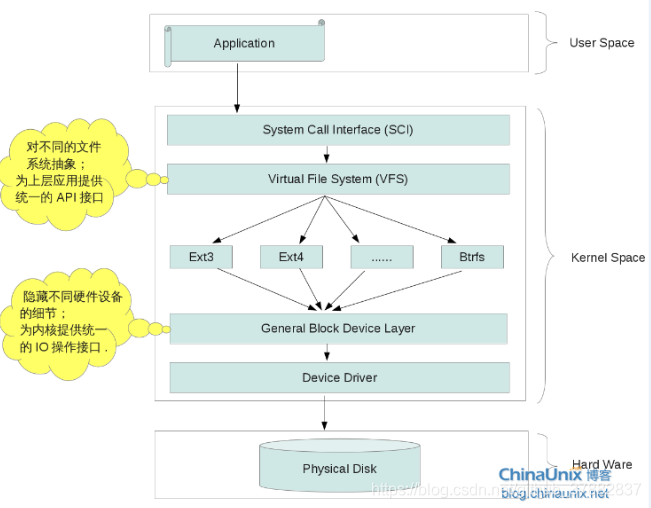

# Linux 文件系统

Unix 中有一个概念：“一切皆文件”，而 Linux 作为 Unix 的重写版本，也保留了这个特性。通过这个特性，用户可以通过读写的方式访问硬件设备。

Linux 默认使用 Ext4 文件系统。

# Linux 文件系统结构

## 硬盘驱动

常见硬盘类型有 PATA, SATA 和 AHCI 等，在 Linux 系统中，对不同硬盘所提供的驱动模块一般都存放在 `/drivers/ata` 目录下。

