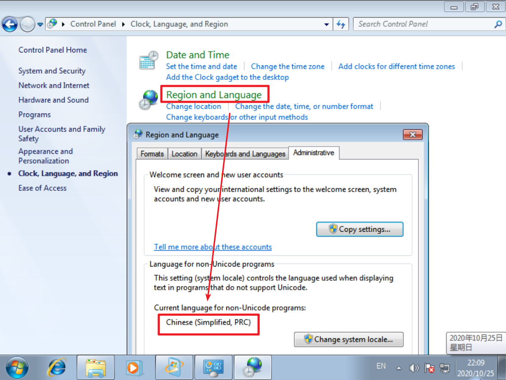

# Windows 7

## 下载&安装

打开 [itellyou](https://msdn.itellyou.cn/)，下载镜像 `Windows 7 Professional with Service Pack 1, VL Build (x64) - DVD (English) `。

!!!warning
    不含 SP1 的镜像文件所安装的虚拟机无法正常安装 VMware Tools，共享文件夹基于 VMware Tools 同样无法使用。
    
    这种虚拟机传输文件要用 FTP 或者 QQ。

*在英文系统中，部分中文软件需要将区域设置为中国后运行
