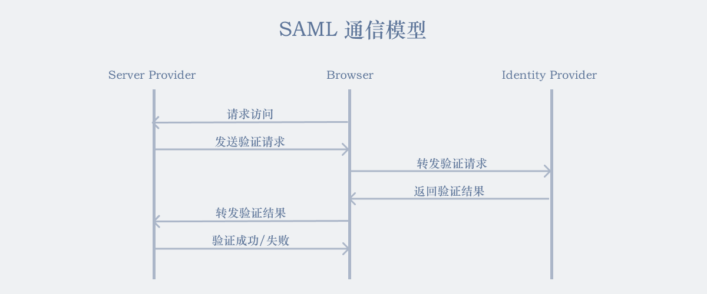

# SSO

SSO (Single Sin On, 单点登录) 用于一次性鉴别登录。

SSO 常用于大型复杂的内网。

## SAML

> SAML 是用于单点登录系统的标准。

SAML (Security Assertion Markup Language, 安全断言标记语言) 是一个基于 XML 的标记语言，用于在不同的安全域 (security domain) 之间交换认证和授权数据。

在 SAML 协议中，**IDP** (Identity Provider) 提供认证，**SP** (Service Providers) 提供服务，两者通过**浏览器重定向**的转发来实现数据交互。

SAML 的数据采用 base64 编码，一般来说签名和断言较容易被篡改，签名让 SP 和 IDP 产生信任关系，断言则使 SP 执行信任操作。

特征如下：
- 参数 `SAMLRequest`